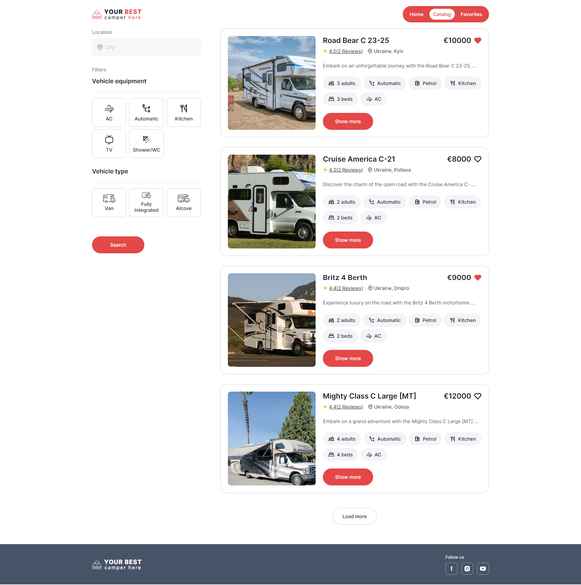
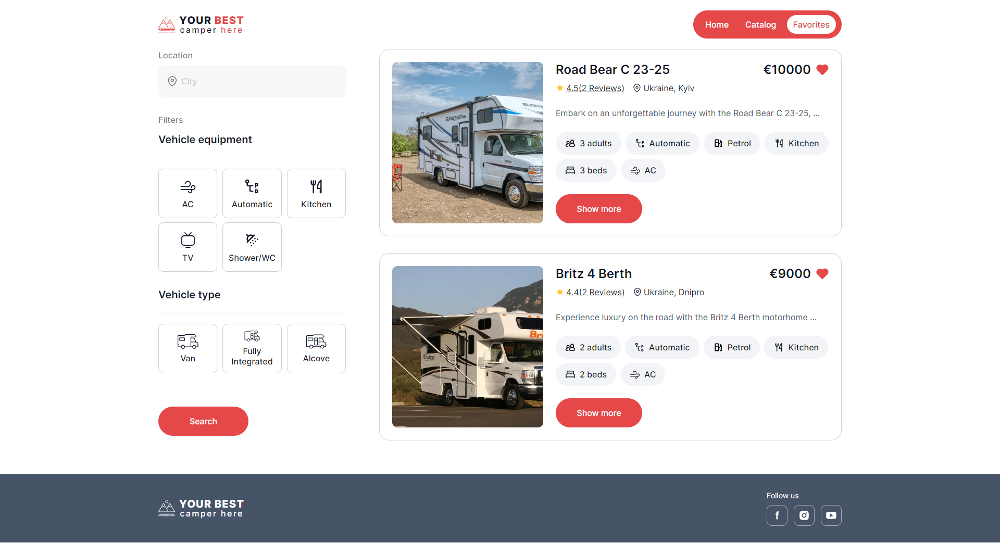

# Description

This app will help everyone find and rent campers vans in Ukraine. To get
started with renting, just visit the web application and browse through the
catalog. Use the search and filter features to locate camper vans that meet your
requirements, and save your preferred options to your favorites list for
convenient access later.

## Usage

### Live view

Live view by clicking
[camper rent app](https://annatsepilova.github.io/campers-rent-app).

### Getting Started with localhost

You can also clone the project and open it in localhost.

#### Installation

1. Clone the repository:

```
git clone <repository-url>
```

2. Install dependencies:

```
npm install
```

#### Usage

To run the project, use the following command:

```
npm start
```

Go to
[http://localhost:3000/campers-rent-app](http://localhost:3000/campers-rent-app)
in your browser. This page will automatically reload after saving changes to the
project files.

## Routes and Features

The application have the following routes:

- `/` - the home page with general overview of the services provided by the
  company and app's features. On the top of the page, user can navigate to
  another pages of the web application.

- `/catalog` - the catalog page contains a catalog of available camper vans for
  rent. Users can use filter and search various configurations of camper vans.
  By clicking on button "Show more" opened up detailed information about each
  camper van, and user can make booking request.

- `/favorites` - the page with personal favorites list of saved camper vans.
  User has easy access to camper vans they are interested in to rent, remind
  details and search in favorites list by features.

## Technologies

- Frontend: React.js, Redux Toolkit
- Backend: [https://mockapi.io/](https://mockapi.io/)
- Library: react-loader-spinner
- API: Axios for HTTP requests
- Deployment: GitHub Pages

## Screenshots

Home page


Catalog Page


Favorites Page

